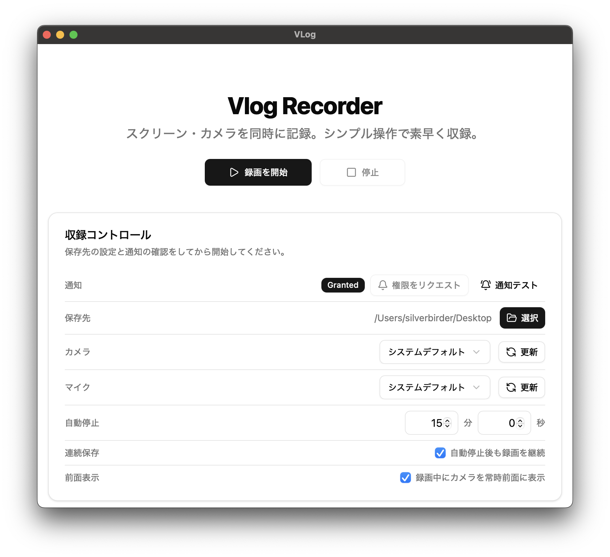

# Vlog Recorder

Vlog Recorder は、スクリーン・カメラを同時に記録できる macOS 向けデスクトップアプリです。ピクチャ・イン・ピクチャでの常時前面表示、自動停止や連続保存といった録画を助ける機能を備え、動画ブログやリモートワークに最適です。



## 対応プラットフォーム

- macOS 15 Sequoia 以降（Apple Silicon)

## 必要なもの

- Node.js 20 以上
- Rust (stable)

Tauri 公式ドキュメントの [必要事項 | Tauri](https://v2.tauri.app/ja/start/prerequisites/) も参照してください。

## インストール手順（macOS）

1. プロジェクトを取得します。

   ```bash
   git clone https://github.com/silverbirder/vlog.git
   cd vlog
   ```

2. 依存パッケージをインストールします。

   ```bash
   npm install
   ```

3. macOS アプリをビルドしてバンドルを生成します。`npm run tauri:build` は `.dmg` バンドルのみを作成します。

   ```bash
   npm run tauri:build
   ```

   成果物は `src-tauri/target/release/bundle/macos/` に出力されます。

4. 生成した `.dmg` を開き、アプリを `Applications` フォルダへドラッグするとインストール完了です。

5. インストール後、アプリケーションフォルダから **Vlog** を起動し、保存先フォルダやデバイスを設定して録画を開始します。

## リリースと配布

GitHub Releases で `.dmg` を自動生成・公開するために、`release-macos-dmg` ワークフローを追加しています。

### セットアップ

1. GitHub リポジトリの **Settings > Secrets and variables > Actions** から以下を設定します。
    - `TAURI_PRIVATE_KEY` / `TAURI_KEY_PASSWORD` (任意)：Apple notarization やコード署名用のキー。未設定でもビルドはできますが、macOS で実行時に警告が表示されます。
2. リポジトリに push されたタグ `v*` をトリガーに、macOS 向け DMG をビルドしてリリースを作成します。

### 使い方

- タグを作成して push すると自動的にビルドが走ります。

   ```bash
   git tag v0.2.0
   git push origin v0.2.0
   ```

- 手動実行も可能です。GitHub Actions 画面から `Run workflow` を選び、既存タグ名を入力します。
- 成功すると GitHub Releases に `.dmg` が添付されたリリースが作成されます。

### 初回起動時の警告について

Apple Developer ID での署名・公証を行っていないため、ダウンロード直後に起動しようとすると Gatekeeper により「破損している可能性がある」等の警告が表示される場合があります。以下のいずれかの方法で回避できます。

1. Finder でアプリを右クリックし「開く」を選び、表示されるダイアログで再度「開く」を押す。
2. アプリを `/Applications` フォルダへコピーした上で、ターミナルから隔離属性を削除する。

   ```bash
   sudo xattr -dr com.apple.quarantine /Applications/VLog.app
   ```

   `/Applications` 以外に置いた場合はパスを書き換えてください。`Permission denied` が出る場合は `sudo` を付与します。

3. （配布者向け）Apple Developer ID を取得してコード署名・公証を行うと、警告なしで起動できます。

## お問い合わせ

不明点があれば Issues や Pull Request でお知らせください。
